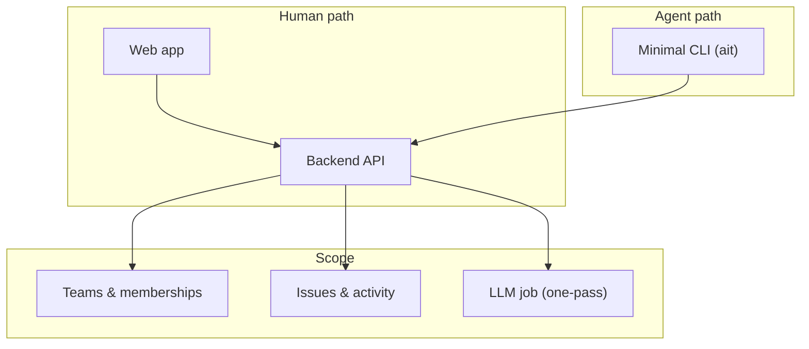
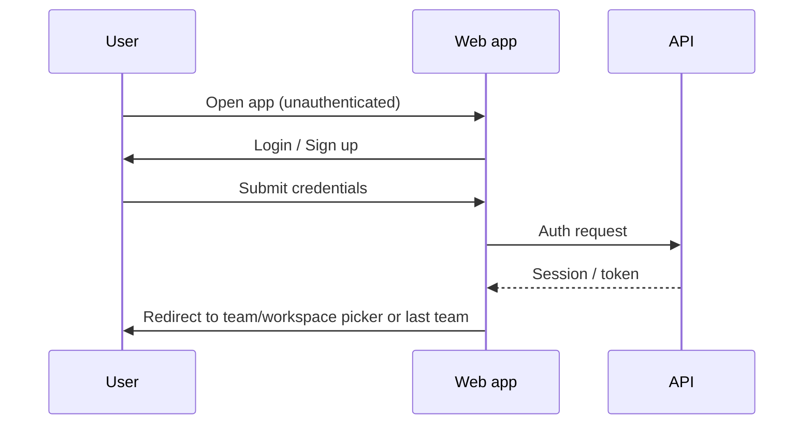
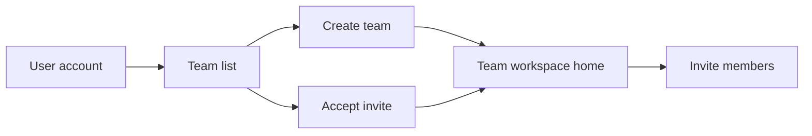
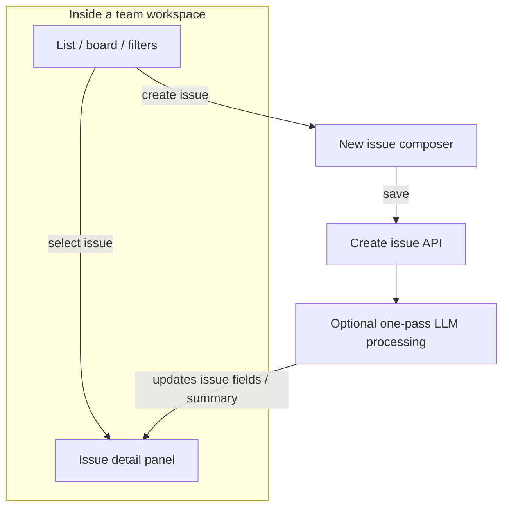
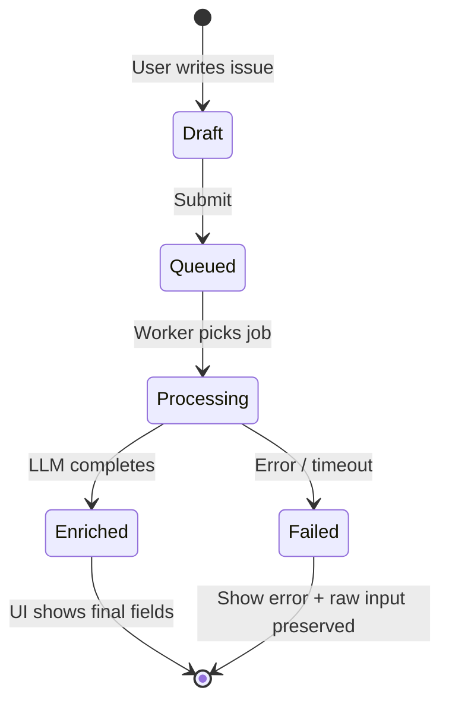
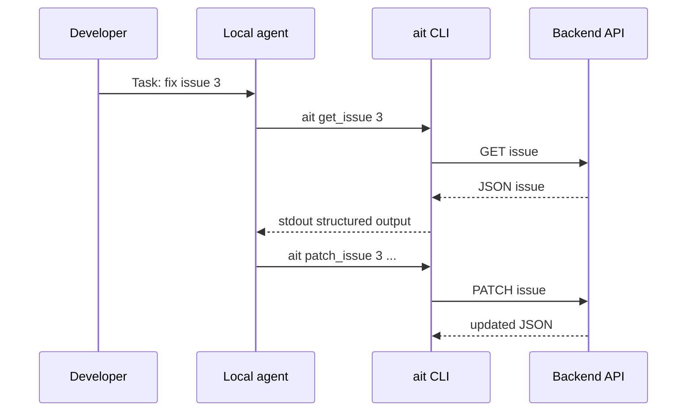
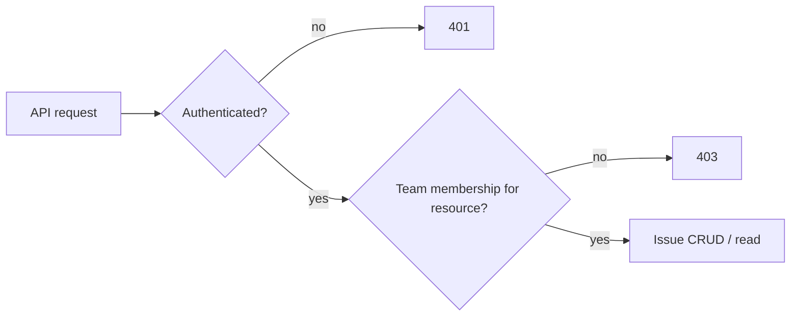

# Agent issue tracker — user workflows & diagrams

Product positioning: **agent-backed issue tracker**. Same backend for **humans (web)** and **agents (CLI)**; teams scope visibility and workspaces.

---

## 1. Personas

| Persona | Goal | Interfaces | Anti-goals |
|--------|------|------------|------------|
| **Engineer / IC** | Track work, update status, comment, link context | Web UI primary | Full dependence on an agent for basics |
| **Tech lead** | Team setup, visibility, light triage | Web UI | Heavy admin overhead |
| **Agent runner** | Pull/push structured issue state from terminal | CLI only | Fancy TUI; confirmation-heavy LLM flows (stretch) |

---

## 2. Conceptual model

- **User** → belongs to **one or more teams** (via membership mapping).
- **Team** = isolated issue tracker space (similar to a GitHub repo): issues, permissions, workspace selection.
- **Issue** = structured record + history; AI may **enrich or classify once** (MVP: **one-pass**, no user confirmation step).

---

## 3. High-level system diagram

---

## 4. Web UI — end-to-end journeys

### 4.1 Auth

**Events to specify in mocks**

- **Login / Sign up**: validation errors inline; submit disabled while pending; redirect target after success (default team vs picker).
- **Session expiry**: toast + redirect to login; preserve return URL if desired later.

### 4.2 Team management (skeleton acceptable if flows are explicit)

**Minimum viable screens / states**

- **Team list**: empty state (“Create or join”), loading skeleton, error retry.
- **Create team**: name + optional slug; success → land in that team’s issue workspace.
- **Invite**: email/role (can be stubbed); **pending invite** visible in UI.
- **Switch team**: global switcher; changing team **reloads issue workspace** (invalidate client cache).

### 4.3 Core issue tracker workflow (daily use)

| Action | What happens | Loading | Failure |
|--------|----------------|---------|---------|
| Click issue in list | Detail panel updates; URL updates (`/issues/:id`) if using deep links | List row highlight; detail skeleton | Toast + list stays usable |
| Create issue | Composer (modal or inline in split pane) | Primary button spinner; prevent double submit | Inline errors; preserve draft |
| Apply filters | List refreshes | Filter chips pending; list skeleton | Revert filter + error toast |
| Resize split panes | Drag handle updates layout; optional persist (e.g. localStorage) | — | — |

### 4.4 LLM one-pass (MVP — no confirmation UI)

**Assumption:** user submits an issue (or an edit triggers re-processing); backend runs **one** LLM pass; user sees **progress**, then **final structured output** — no approve/reject step.

**UI states (prototype quality)**

1. **Immediately after submit**: issue appears in list with status **Processing** (or badge on detail).
2. **Detail view**: clear progress — indeterminate bar or staged labels only if truthful (otherwise one message: “AI is updating this issue…”).
3. **Completion**: structured fields **replace placeholders** (title, labels, priority, summary). Activity log: “AI enrichment completed”.
4. **Failure**: banner on issue; **retry** if supported; never discard user text.

**Stretch (out of MVP):** diff / review / confirm before commit.

---

## 5. CLI — minimal agent-oriented workflow

**Purpose:** agents (e.g. Claude in terminal) interact with the **same** issues API — separate from the frontend.

### 5.1 Typical session

### 5.2 What to show (minimal, AI-centric)

- **Default**: **JSON** on stdout (stable schema; version fields help agents).
- **stderr**: errors (`401`, `404`, validation) in plain text.
- **Stretch**: `--pretty` / `--table` for humans.

### 5.3 Monitoring / trust

- Users rely on **agent logs** + **issue activity** on the server, not a rich CLI UI.
- Prefer **non-interactive** flags (`--json`, `--token-env`, explicit IDs) for scripts.

**Illustrative commands**

- `ait get_issue <id>` — full issue + last AI metadata.
- `ait patch_issue <id> --status done` — structured update; echo new state.
- `ait list_issues --team <slug> --limit 20` — paginated JSON.

---

## 6. Permissions (teams)

UI: **403** → “You don’t have access” + link to team switcher.

---

## 7. User stories

1. **As a teammate**, I can **create an issue quickly** without waiting for AI; AI **augments** in the background.
2. **As a user in multiple teams**, I can **switch workspaces** without mixing issue lists.
3. **As an IC**, I can **triage from the list** with filters without the layout breaking; **resizable split view** improves scanning vs detail.
4. **As an agent runner**, I can **get/update issues from the terminal** with stable JSON.

---

## 8. Miro / design checklist

- **Screens**: Login, Sign up, Team list, Create team, Invite (stub), Workspace shell (split view), Issue list, Issue detail, Create issue + **LLM states**, Errors.
- **Flows**: click → route → API → UI; **loading** at each step.
- **Swimlanes**: Human + browser vs Agent + CLI.
- **Decisions**: One-pass LLM; no confirmation UI; CLI stays minimal.

---

## 9. Prototype critique targets (alignment with group feedback)

- **Split view**: draggable divider, min widths, optional local persistence.
- **Readability**: max width for issue body; shorter line length for long descriptions.
- **Filters**: avoid layout jump — reserve space for empty/loading states.
- **LLM**: treat **processing** as a visible **issue state** in the list, not only a detail-panel spinner.

---

*Generated for planning; revise team URLs/slug rules when product decisions are final.*

---

# User Story Workflow
- Team Lead
  1. Create Acctount / Log in
  2. Create Workspace / Upload repo 
    - Submit credentials + authentication request 
  3. Create Invite Link 
  4. Upload issues 
- Team Member
  1. Click invite link
  2. create account / log in
  3. view different workspaces 
  4. View & upload issues 
    - Create draft & submit
    - Queue issue
    - process issue
    - Issue addressed by LLM/user
    - Review